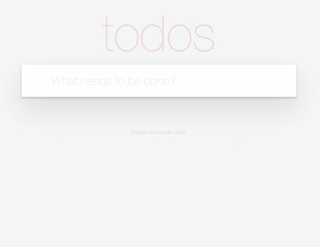
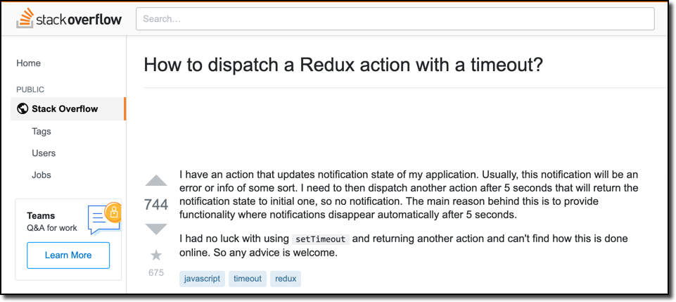
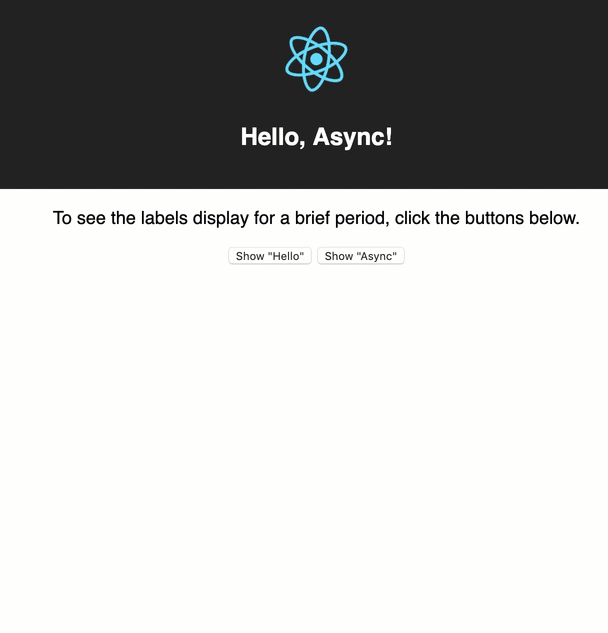
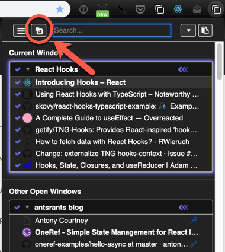
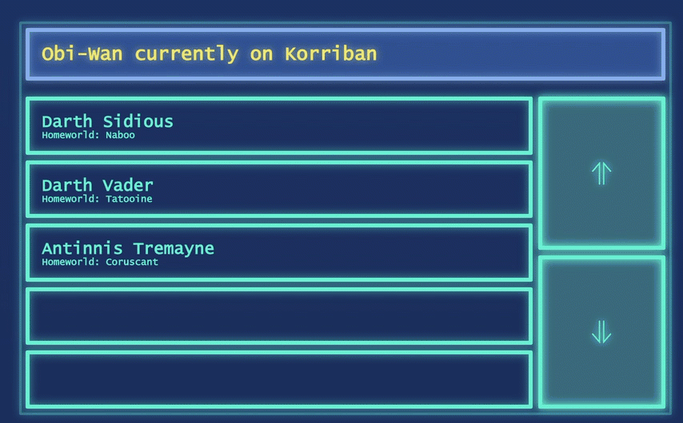

---

<strong>A Quick Caveat:</strong> I happen to work at Facebook, home of the
React team.
While I have immense admiration for the work of the React team,
I do not work with them directly. In fact, I don't even do React
development as part of my job.
The work reported here
was done entirely on my own time as part of
maintaining [Tabli](https://chrome.google.com/webstore/detail/tabli/igeehkedfibbnhbfponhjjplpkeomghi) and [Tad](https://www.tadviewer.com), my hobby open source side projects.
Any and all mistakes, terrible ideas, conclusions, opinions or recommendations included here are entirely my own, not those of Facebook or any Facebook team.

---

## The Challenge of Asynchrony

One of the most challenging aspects of developing React applications is managing the interaction of application state with asynchronous operations.
In the Redux ecosystem this problem is
addressed by middleware libraries such as [redux-thunk](https://github.com/reduxjs/redux-thunk) and [redux-saga](https://redux-saga.js.org/).

<strong>OneRef</strong> is a tiny state management library
written in TypeScript for use with React. While developing OneRef, I struggled
with how best to address the asynchrony problem. After considering some
alternatives, I added a couple of additional primitive operations
(**mutableGet** and **awaitableUpdate**) to the OneRef API.
These additions seem to cleanly support interaction of asynchronous
operations with application state, but
the interface and implementation could be controversial.
I am writing this post to present these parts of the API and solicit feedback
from the React community.

## A Quick Recap of OneRef

The core
API of OneRef is:

```typescript
type StateTransformer<T> = (s: T) => T;
type StateRef<T> = ...; // opaque
function update<T>(ref: StateRef<T>, tf: StateTransformer<T>) { ... }
```

The **update** function in OneRef is similar to the [functional update](https://reactjs.org/docs/hooks-reference.html#functional-updates) variant of [useState](https://reactjs.org/docs/hooks-reference.html#usestate) in React Hooks. The only slight difference is the additional **ref** parameter
that is passed down through React views and into event handler callbacks.

Event handlers call OneRef's **update** function to update application state, passing in a **stateRef** that is passed down the component
hierarchy via props. For example:

```typescript
import { StateRef, update } from 'oneref';
// ...
// functional React component:
const Header = ({ stateRef }: HeaderProps) => {
  const onSave = (text: string) => {
    if (text.trim()) {
      update(stateRef, actions.createTodo(text));
    }
  };
  // ...
};
```

**Actions** in OneRef are ordinary JavaScript functions that typically return a state transformer (a pure state to state function) that can be passed to **update**.
For example:

```typescript
export const createTodo = (text: string): StateTransformer<TodoAppState> => {
  const item = new TodoItem(text);
  return state => state.addItem(item);
};
```

At the top level, the application calls **appContainer**, which will create and inject
the **StateRef** passed down the component hierarchy:

```typescript
const initialAppState = new TodoAppState();

const TodoApp = oneref.appContainer<TodoAppState>(
  initialAppState,
  TodoListEditor
);

ReactDOM.render(<TodoApp />, document.getElementsByClassName('todoapp')[0]);
```

A more thorough introduction to OneRef, including this complete example, is provided in [a companion post](../oneref-intro)
to this one.

### Basic Asynchronous Subscriptions

To begin with, let's consider a simple extension of the TodoMVC Example (from the [introductory post](../oneref-intro))
to support sharing a Todo list with
several users. The complete working
example is available [on CodeSandbox](https://codesandbox.io/s/github/antonycourtney/oneref-examples/tree/master/todo-async-basic)
and in the [OneRef examples repository](https://github.com/antonycourtney/oneref-examples/tree/master/todo-async-basic).

A real shared, multi-user Todo list would involve a fairly sophisticated synchronization protocol. For exposition, we'll focus only on creation of new Todo list items by other users. The working
Todo list app might look like this as new items are added by other users:



Let's assume our Todo list server provides a very simple subscription API via a **subscribe** function that
invokes a callback whenever an entry is added to the Todo list:

```typescript
type TodoListener = (entry: string) => void;
export const subscribe = (listener: TodoListener);
```

The relevant changes to `index.tsx` to implement this example are:

```typescript
...
import {
    appContainer,
    StateRef,
    AppStateEffect,
    update
} from 'oneref';
...

const init: AppStateEffect<TodoAppState> = (
  appState: TodoAppState,
  stateRef: StateRef<TodoAppState>
) => {
  todoServer.subscribe((entry: string) => {
    update(stateRef, actions.createTodo(entry));
  });
};

const initialAppState = new TodoAppState();

const TodoApp = appContainer<TodoAppState, {}>(
    initialAppState,
    TodoListEditor,
    init
);

ReactDOM.render(<TodoApp />, document.getElementsByClassName('todoapp')[0]);
```

As with [the basic version of this example](../oneref-intro/#todomvc-in-oneref), we call **appContainer** to create the top-level React application component. This time, however, we are passing an extra **init** argument, of type **AppStateEffect&lt;TodoAppState&gt;**. This is a function that will be
called to perform any initialization side effects, in this case setting up the subscription.

The body of **init** sets up the subscription, calling **actions.createTodo**
for every **entry** value provided by the subscription. Recall that
**createTodo** returns a **StateTransformer** to calculate a new state (with
**entry** added) from the existing state. In order to ensure this works
correctly, OneRef guarantees that the **StateRef** value is stable across
state updates over the entire lifetime of the top level application
component instance.

### Hello, Async!

The previous subscription example demonstrates one simple but common use case: an asynchronous operation or event callback that updates application state asynchronously. That example didn't require any new primitives; the application
just calls **update** from the subscription callback.

In real applications, it's common for actions to need to perform sequences of asynchronous operations, where operations later in the sequence are invoked only after earlier operations complete. The syntax
for **async** blocks in ES6 support exactly such sequencing. And, as we have seen, there's no problem
with calling **update** from a callback context, including async blocks.

The challenge, though, is that **update** is a _write-only_ operation, and does its work asynchronously --
the update can not be applied synchronously to the current state since state must remain
frozen throughout the current render cycle or callback. **update** allows the application to arrange for an
update to application state, but provides no mechanism for invoking asynchronous operations based on the result
of applying the update. This presents a significant challenge for classic
Redux or OneRef as described thus far.

The extent to which this is a challenging problem is reflected in the length and breadth of answers to [this
StackOverflow question](https://stackoverflow.com/questions/35411423/how-to-dispatch-a-redux-action-with-a-timeout/38574266):



[Tyler Long](https://stackoverflow.com/users/862862/tyler-long) was kind enough to distill this question down to
a concise runnable example made with create-react-app and create a [Github repository](https://github.com/tylerlong/hello-async) with runnable versions of the various Redux
and Redux-middleware solutions.

The OneRef implementation of the hello-async example, when running, looks like this:



Each of the buttons adds a label to the UI that is displayed for a fixed timeout period. After the timeout period, the label is hidden. A runnable version of this example is available [on Codesandbox](https://codesandbox.io/s/github/antonycourtney/oneref-examples/tree/master/hello-async) and in [the oneref-examples repository](https://github.com/antonycourtney/oneref-examples/tree/master/hello-async).

As before, the application state is represented with an Immutable.JS Record:

```typescript
import * as Immutable from 'immutable';
import Notification from './notification';

interface AppStateProps {
  nextId: number;
  notifications: Immutable.List<Notification>;
}

const defaultAppStateProps: AppStateProps = {
  nextId: 0,
  notifications: Immutable.List(),
};

export default class helloAppState extends Immutable.Record(
  defaultAppStateProps
) {
  show(text: string): [this, number] {
    const n = new Notification(this.nextId, text);

    const nextSt = this.set('notifications', this.notifications.push(n)).set(
      'nextId',
      this.nextId + 1
    );
    return [nextSt, n.id];
  }

  hide(id: number): this {
    return this.set(
      'notifications',
      this.notifications.filter(n => n.id !== id)
    );
  }
}
```

Here we maintain `nextId` as part of the main application
state, so the specific `id` value for a notification is only available after calling **show**, which returns
a pair of a next application state and the id for the notification that will be displayed.

The React UI is straightforward; the essential part is this:

```typescript
<div>
  <button
    onClick={() => actions.showNotificationWithTimeout(stateRef, 'Hello')}
  >
    Show "Hello"
  </button>
  &nbsp;
  <button
    onClick={() => actions.showNotificationWithTimeout(stateRef, 'Async')}
  >
    Show "Async"
  </button>
  {appState.notifications.map(notification => (
    <h1 key={notification.id}>{notification.text}</h1>
  ))}
</div>
```

The most interesting part of the implementation is the implementation of the single action in this application,
**showNotificationWithTimeout**:

```typescript
import {
  StateRef,
  update,
  awaitableUpdate,
  utils as oneRefUtils,
} from 'oneref';
import HelloAppState from './helloAppState';

const delay = oneRefUtils.delay;

export async function showNotificationWithTimeout(
  stateRef: StateRef<HelloAppState>,
  text: string
): Promise<void> {
  const [_, id] = await awaitableUpdate(stateRef, st => st.show(text));
  await delay(5000);
  update(stateRef, st => st.hide(id));
}
```

This differs from previous actions we've seen in two important ways: First, **stateRef** is passed in directly to the action, instead of the action returning a **StateTransformer** that the caller passes to **update**.
Second, this is an **async** function. Since it's called from a non-async function (the **onClick** callback),
**showNotificationWithTimeout** is effectively a co-routine that executes independently alongside the rest of the
application.

The most interesting part of this action is the call to **awaitableUpdate**, a new primitive
added to OneRef that has the following signature:

```typescript
// A StateTransformer with an additional calculated value:
export type StateTransformerAux<T, A> = (s: T) => [T, A];
export async function awaitableUpdate<T, A>(
  ref: StateRef<T>,
  tf: StateTransformerAux<T, A>
): Promise<[T, A]>;
```

A **StateTransformerAux** is a similar to a **StateTransformer**, but also returns an extra auxiliary value along
with the next state.
**awaitableUpdate** is an async function that,
like **update**, schedules an update of the application state referenced by **stateRef**. However, after updating
the application state (using the first component of the pair returned by **tf**), **awaitableUpdate** resolves
the promise returned from **awaitableUpdate**, making the [State, Auxiliary Value] pair available to **awaitableUpdate**'s caller.
In **showNotificationWithTimeout**, the call to **HelloAppState.show** returns a pair of the next application state and the id
of the newly created notification added to the application state. The call to **awaitableUpdate** in **showNotificationWithTimeout**
binds this auxiliary value to the local variable **id** after the update has been applied and allows execution of the async block to proceed.

At first it seems a bit odd to provide an awaitable version of **update** -- why should the application await on its
own state updates? But recall that **update** _must_ do its work asynchronously to ensure that state is consistent throughout a given
render cycle or callback. The addition of **awaitableUpdate** solves an important practical problem: It enables an async block to resume _after_ an update has been applied and see fresh data derived from the updated application state.

This enables writing complex application action sequences with linear control flow in the style of redux-saga (a source of inspiration for this work), using async functions instead of generator functions.
Generator functions and redux-saga's generalized algebraic effects are extremely powerful, so I don't expect or claim that OneRef with awaitableUpdate subsumes everything that can be expressed with redux-saga. The hope is that the
addition of **awaitableUpdate** offers sufficient expressive power to cover many essential use cases in real
applications; that's been my experience thus far on the examples I have tried.

### mutableGet

In using this latest version of **OneRef** to port [Tabli](https://chrome.google.com/webstore/detail/tabli/igeehkedfibbnhbfponhjjplpkeomghi) (a Chrome extension for tab management) to TypeScript and Hooks, I observed
that, in many cases, action functions invoked as callbacks needed read access to the application
state at the time the callback is invoked (as opposed to the time the callback was created),
without necessarily needing to perform an update to the state.

A good example of this is the behavior of Tabli's popout button:



The intended behavior of the popout button is that it should open the Tabli popout window only if it is not currently open. If it is already open, the popout button should transfer focus to the (already open) popout window instead of opening a new one.

Tabli maintains a detailed snapshot of all open windows as part of its application state, including the current
popout window. The implementation of the **showPopout** action in Tabli is:

```typescript
export const showPopout = (stateRef: StateRef<TabManagerState>) => {
  const ptw = mutableGet(stateRef).getPopoutTabWindow();
  if (ptw) {
    tabliBrowser.setFocusedWindow(ptw.openWindowId);
  } else {
    chromep.windows.create({
      url: 'popout.html',
      type: 'popup',
      left: 0,
      top: 0,
      width: Constants.POPOUT_DEFAULT_WIDTH,
      height: Constants.POPOUT_DEFAULT_HEIGHT,
    });
  }
};
```

This action makes use of **mutableGet**, another OneRef primitive API function with the following signature:

```typescript
export function mutableGet<T>(ref: StateRef<T>): T;
```

The behavior of **mutableGet** is what one would intuitively expect: it (synchronously) returns the
current state value referenced by a **stateRef**. The verbose name of this function is intended as
something of a warning label to indicate that repeated calls to mutableGet on the same **stateRef**
at different points in the execution of the program may return different values. While it is
reasonable to call **mutableGet** within the (imperative) body of an action function in response to
an event, one should never call **mutableGet** directly in the body of a React functional component or **render()** method,
since these should ideally be pure functions of their props that can be memoized with **React.memo**.

### Andre Staltz's Flux Challenge

A final example of the interaction of application state with asynchronous requests comes from the [Flux Challenge](https://github.com/staltz/flux-challenge) by Andre Staltz. The Flux Challenge is another example application for a
real-time dashboard user interface for monitoring the movement of Jedi and Sith in the Star Wars Universe:



The application involves both subscribing to a web socket and issuing http fetch requests in response to user
actions to populate the dashboard. The requirements for the challenge are quite intricate, but express the
sorts of messy, complex requirements of real applications and asynchronous platform APIs. For example,
the requirements stipulate:

> When either the current planet indicator changes OR loaded new rows: check if there is a displayed Dark
> Jedi whose home planet matches the current planet. If true, then display that Dark Jedi in red text,
> and cancel ALL ongoing HTTP requests for rows. Freeze the UI from scrolling until the current planet
> changes again and there is no red-highlighted Dark Jedi anymore.

The OneRef implementation of the Flux Challenge can also be found in the [OneRef examples repository](https://github.com/antonycourtney/oneref-examples/tree/master/flux-challenge). Unfortunately this example also requires running
a separate WebSocket server (provided in the [original flux challenge repository](<(https://github.com/staltz/flux-challenge)>)), so I can't provide a live version in
a CodeSandbox.

This post is pretty long already, so I'll forego a
complete walk-through of this example. But **awaitableUpdate**
enabled a fairly concise implementation of this example in OneRef.
For example, here is the implementation of
the async action invoked in response to updates to Obi-Wan's position from the WebSocket subscription, to implement
the behavior described in the above requirement:

```typescript
const updateObiWan = async (
  parsedLocation: any,
  stateRef: StateRef<DashboardAppState>
) => {
  const [nextSt, oldRequests] = await awaitableUpdate(stateRef, state => {
    const obiWanLocation = new DT.PlanetInfo(parsedLocation);
    const locState = state.set('obiWanLocation', obiWanLocation);
    return locState.checkMatchingSith();
  });
  cancelOldRequests(oldRequests);
  if (!nextSt.matchingSith()) {
    fillView(nextSt, stateRef);
  }
};
```

## Summary

This post presented a few examples to illustrate the use of **awaitableUpdate**
and **mutableGet**, additions to the OneRef API to support interaction of
asynchronous platform operations with application state. These additions
to the OneRef API enable the use of ordinary ES6 async functions to express
asynchronous action handlers, while still
using pure, functional React components and pure functions for state updates.
