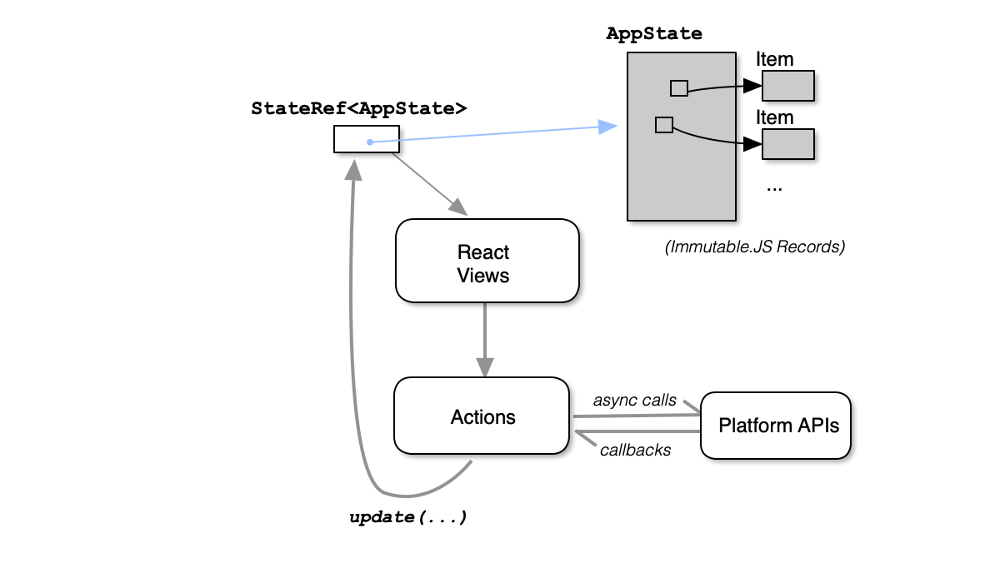

<strong>UNPUBLISHED DRAFT</strong>: This is an unpublished draft. If you are reading this, it is hopefully because I invited you to review this. <strong>Please do not share the link to
this post with others or on social media yet.</strong> Thank You!

---

<strong>A Quick Caveat:</strong> I happen to work at Facebook, home of the
React team.
While I have immense admiration for the work of the React team,
I do not work with them directly. In fact, I don't even do React
development as part of my job.
The work reported here
was done entirely on my own time as part of
maintaining [Tabli](https://chrome.google.com/webstore/detail/tabli/igeehkedfibbnhbfponhjjplpkeomghi) and [Tad](https://www.tadviewer.com), my hobby open source side projects.
Any and all mistakes, terrible ideas, conclusions, opinions or recommendations included here are entirely my own, not those of Facebook or any Facebook team.

---

> Everything should be made as simple as possible, but not simpler.
> --Albert Einstein

<strong>OneRef</strong> is a tiny (around 150 lines of code) state management library
written in TypeScript for use with React.
The goal of OneRef is to present a programming interface for state management that is as
simple as possible while still providing enough features and
expressive power to support real-world use cases such as interaction of application state with asynchronous platform APIs.

I originally developed OneRef in 2015 as a simpler alternative to the [Flux architecture](https://facebook.github.io/flux/docs/overview.html). I used it in my first production React application
([Tabli](https://chrome.google.com/webstore/detail/tabli/igeehkedfibbnhbfponhjjplpkeomghi), a tab manager extension for Google Chrome), and later in [Tad](https://www.tadviewer.com), a desktop application for viewing and analyzing CSV files.
By the time I completed the initial version of OneRef in 2015,
[Redux](https://redux.js.org/) had gained considerable traction and established itself as the de facto
standard for React state management. At the time I decided that Redux was sufficiently similar to OneRef that OneRef wasn't worth publicizing widely.

I recently rewrote OneRef in TypeScript. In the process, I struggled with a problem that still seems to present a significant challenge when using state management libraries: How to cleanly support interleaving asynchronous platform operations with reading and writing application state. I'm documenting OneRef now primarily to present
this part of the OneRef design and solicit feedback from the React community, a
subject explored in depth in my next post.

This first post presents an
introduction to the basics of OneRef by walking
through a few examples in detail, making minimal assumptions about background
knowledge beyond a basic understanding of React.
The next post, [Asynchrony Support in OneRef](../oneref-async), focuses
specifically on OneRef's support for interaction with asynchronous platform APIs.
Readers already familiar with state management libraries like Redux may wish to
lightly skim this post and proceed directly to [the companion post on asynchrony](../oneref-async).

## OneRef Overview

This section presents an overview of OneRef.

The OneRef architecture looks roughly like this:



The application state (AppState) is represented as a purely functional (immutable) data structure.
I use [Immutable.JS](https://immutable-js.github.io/immutable-js/) for this purpose, but this is not a strict requirement;any immutable data structure representation should do, and oneref does not depend on ImmutableJS.

At the top level of a OneRef application, there is a single mutable ref cell
(**StateRef**) that holds the current application state.

Application state is updated in OneRef by calculating a new AppState from the existing AppState and setting the top level StateRef to this new AppState. OneRef provides a single entry point, **update**, for this purpose:

```typescript
type StateTransformer<T> = (s: T) => T;
type StateRef<T> = ...; // opaque
function update<T>(ref: StateRef<T>, tf: StateTransformer<T>) { ... }
```

The update function in OneRef is similar to the [functional update](https://reactjs.org/docs/hooks-reference.html#functional-updates) variant of [useState](https://reactjs.org/docs/hooks-reference.html#usestate) in React Hooks. The only slight difference is the additional ref parameter
that is passed down through React views and into event handler callbacks.

**Actions** in OneRef are ordinary JavaScript functions called by event handlers in view components. They typically live in a source file outside of the React views, take whatever parameters are needed to perform the action, and calculate a **StateTransformer** function (a pure **State => State** function)
that will be passed to **update** to update the application state.

## TodoMVC in OneRef

To make the previous discussion a bit more concrete, let's walk through the implementation of a complete example -- the classic Todo list application of [TodoMVC](http://todomvc.com/). The complete working
example is available [on CodeSandbox](https://codesandbox.io/s/github/antonycourtney/oneref-examples/tree/master/todomvc)
and in the [OneRef examples repository](https://github.com/antonycourtney/oneref-examples/tree/master/todomvc).


To begin with, let's define an immutable representation of application state using [Immutable.JS Records](https://immutable-js.github.io/immutable-js/):

First we have the representation of individual items in the Todo list:

```typescript
import { Record } from 'immutable';

interface ItemProps {
  id: string;
  complete: boolean;
  text: string;
}

const defaultItemProps: ItemProps = {
  id: '',
  complete: false,
  text: '',
};

/* auxiliary function to generate a fresh id */
function genID() {
  return (+new Date() + Math.floor(Math.random() * 999999)).toString(36);
}

export default class TodoItem extends Record(defaultItemProps) {
  constructor(text: string, complete = false) {
    super({ id: genID(), text, complete });
  }
}
```

The Application State (AppState) is an immutable record, with a single field, **todoItems**, an (immutable) Map from item id to items:

```typescript
import { Map, Record, Seq } from 'immutable';
import TodoItem from './todoItem';

interface AppStateProps {
  todoItems: Map<string, TodoItem>;
}

const defaultStateProps: AppStateProps = {
  todoItems: Map(),
};

export default class TodoAppState extends Record(defaultStateProps) {
  /**
   * Add / update a TODO item
   *
   * functional item update -- returns a new state with the given item included in the
   * set of todo items.  If there is an existing entry for item.id, the result state
   * will map id to item (functional update).
   */
  addItem(item: TodoItem): TodoAppState {
    const nextTodoItems = this.todoItems.set(item.id, item);
    return this.set('todoItems', nextTodoItems);
  }

  /**
   * functional delete -- returns a new state with the item for the given id removed
   */
  removeItem(id: string): TodoAppState {
    const nextTodoItems = this.todoItems.delete(id);
    return this.set('todoItems', nextTodoItems);
  }

  /** An Immutable.Seq of all todo items */
  getAll(): Seq.Set<TodoItem> {
    return this.todoItems.toSetSeq();
  }

  /* returns true iff all items are complete */
  areAllComplete(): boolean {
    return this.todoItems.every(item => item.complete);
  }
}
```

**TodoAppState** includes a few convenience methods, such as **addItem**. These methods
are all functional in the sense that they do not perform in-place updates; instead they return a
new **TodoAppState** object. Immutable.JS uses structural sharing to ensure that this is relatively efficient. Thus far, all of this is independent of OneRef.

The UI is implemented as a set of functional React components. A representative example is **Header**, which contains the text entry component used to add an item to the todo list:

```typescript
import React from 'react';
import TodoAppState from '../todoAppState';
import TodoTextInput from './TodoTextInput';
import * as actions from '../actions';
import { StateRef, update } from 'oneref';

interface HeaderProps {
  stateRef: StateRef<TodoAppState>;
}

const Header = ({ stateRef }: HeaderProps) => {
  const onSave = (text: string) => {
    if (text.trim()) {
      update(stateRef, actions.createTodo(text));
    }
  };

  return (
    <header className="header">
      <h1>todos</h1>
      <TodoTextInput
        className="new-todo"
        placeholder="What needs to be done?"
        onSave={onSave}
      />
    </header>
  );
};
export default Header;
```

The props for this component includes **stateRef**, which is passed down the component hierarchy. The **onSave** callback for the text entry component calls **update** to update the
application state, passing in **stateRef** and the result of **actions.createTodo(...)**.

The **actions** module contains the actions such as **createTodo** that return **StateTransformer**
functions (pure functions from AppState to AppState) that can be passed to **update**:

```typescript
import TodoItem from './todoItem';
import TodoAppState from './todoAppState';
import { StateTransformer } from 'oneref';

export const createTodo = (text: string): StateTransformer<TodoAppState> => {
  const item = new TodoItem(text);
  return state => state.addItem(item);
};

export const clearCompleted: StateTransformer<TodoAppState> = state => {
  const completedIds = state
    .getAll()
    .filter(item => item.complete)
    .map(item => item.id);
  return completedIds.reduce((s, id) => s.removeItem(id), state);
};

export const updateText = (
  item: TodoItem,
  text: string
): StateTransformer<TodoAppState> => state =>
  state.addItem(item.set('text', text));

export const toggleComplete = (
  item: TodoItem
): StateTransformer<TodoAppState> => state =>
  state.addItem(item.set('complete', !item.complete));

export const toggleCompleteAll: StateTransformer<TodoAppState> = state => {
  const targetVal = !state.areAllComplete();
  // We'll set completed state of all items to targetVal:
  const updItems = state.getAll().map(item => item.set('complete', targetVal));
  const nextState = updItems.reduce((st, item) => st.addItem(item), state);
  return nextState;
};

export const destroy = (id: string): StateTransformer<TodoAppState> => state =>
  state.removeItem(id);
```

To tie everything together, at the top level the application creates an initial
**TodoAppState** instance, and calls **oneref.appContainer** to construct a top-level
React component. The argument to **appContainer** is a functional React
component that will receive the initial application state and **stateRef** as props, injected
by **appContainer**:

```typescript
import React from 'react';
import ReactDOM from 'react-dom';
import * as oneref from 'oneref';
import TodoListEditor from './components/TodoListEditor';
import TodoAppState from './todoAppState';

import 'todomvc-common/base.css';
import 'todomvc-app-css/index.css';

const initialAppState = new TodoAppState();

const TodoApp = oneref.appContainer<TodoAppState>(
  initialAppState,
  TodoListEditor
);

ReactDOM.render(<TodoApp />, document.getElementsByClassName('todoapp')[0]);
```

## Composition

Another concern with state management libraries is _composition_: How can we take applications developed with OneRef and compose them into larger applications?

As an example, consider building a "Multi-TodoList" application that provides distinct Todo lists for work and personal entries, each composed of an independent, fully functioning version of the Todo list editor from the previous section.
The complete working
example is available [on CodeSandbox](https://codesandbox.io/s/github/antonycourtney/oneref-examples/tree/master/multitodo)
and in the [OneRef examples repository](https://github.com/antonycourtney/oneref-examples/tree/master/multitodo). When running, the example looks like this:


(Regrettably the "Work" and "Personal" header labels really are horribly
overlapping as shown in the above screenshot, due to
the CSS from the **todomvc-app-css** package [using absolute positioning](https://github.com/tastejs/todomvc-app-css/blob/master/index.css#L71).
Since a fix is non-trivial (other elements depend on this absolute positioning),
this isn't a post about CSS, my CSS skills are terrible, and everything else
about this example seems to work, I'm leaving this as-is.
But if it really bothers you, your CSS skills are better than mine (a low bar!)
and you're feeling generous with your time, I'd gladly welcome a pull
request with a fix.)

To begin with, we'll define the MultiTodo application state as an Immutable.JS
Record with two fields, **work** and **personal**, each of type **TodoAppState**,
the application state of a complete Todo list:

```typescript
interface MultiAppStateProps {
  work: TodoAppState;
  personal: TodoAppState;
}

const defaultStateProps: MultiAppStateProps = {
  work: new TodoAppState(),
  personal: new TodoAppState(),
};

export default class MultiTodoAppState extends Record(defaultStateProps) {}
```

<br/>

To compose a larger OneRef-based application like MultiTodo from its smaller pieces,
OneRef provides a single API function, **focus**, created from an application-supplied
pair of _projection_ and _injection_ functions.

A _projection_ function tells OneRef how to extract (or project) a value of some
smaller, inner type (_IT_) from an outer type _OT_:

```typescript
type ProjectFunc<OT, IT> = (o: OT) => IT;
```

An _injection_ function takes a value of an outer type (_OT_) and a value of an inner type (_IT_), and calculates a new value of the outer type (with the value of the inner type injected), i.e. a form of functional update:

```typescript
type InjectFunc<OT, IT> = (o: OT, i: IT) => OT; // i.e. functional update
```

Given these two definitions, here is the definition of **focus** in the OneRef
API:

```typescript
type FocusFunc<OT, IT> = (o: OT, outerRef: StateRef<OT>) => [IT, StateRef<IT>];
export const focus = <OT extends {}, IT extends {}>(
    project: ProjectFunc<OT, IT>,
    inject: InjectFunc<OT, IT>
): FocusFunc<OT, IT>
```

While the type signature of **focus** may appear daunting at first,
in practice its use is straightforward:
The developer provides **focus** with specific _project_ and _inject_ functions,
and **focus** gives back a **FocusFunc**, which the application programmer uses
to obtain a **StateRef** and state value of the inner type from a state value
and **StateRef** of the outer type.

To make this more concrete, here is how **focus** is used in MultiTodo:

```typescript
type MultiTodoListEditorProps = {} & oneref.StateRefProps<MultiTodoAppState>;

const workFocus = oneref.focus<MultiTodoAppState, TodoAppState>(
  as => as.work,
  (as, w) => as.set('work', w)
);
const personalFocus = oneref.focus<MultiTodoAppState, TodoAppState>(
  as => as.personal,
  (as, p) => as.set('personal', p)
);

const MultiTodoListEditor: React.FunctionComponent<
  MultiTodoListEditorProps
> = ({ appState, stateRef }: MultiTodoListEditorProps) => {
  const [workTodos, workStateRef] = workFocus(appState, stateRef);
  const [personalTodos, personalStateRef] = personalFocus(appState, stateRef);

  return (
    <>
      <TodoListEditor
        label="work"
        appState={workTodos}
        stateRef={workStateRef}
      />
      <TodoListEditor
        label="personal"
        appState={personalTodos}
        stateRef={personalStateRef}
      />
    </>
  );
};
```

The remainder of the application remains exactly as before -- all of the immutable
application state definitions, React components, and actions from the original Todo list example can be reused without modification.

## Comparison with Redux

For those familiar with Redux, the similarities and differences from Redux should be apparent from these examples:

- Redux and OneRef are similar in that both are based on immutable application state that remains
  frozen throghout each render cycle, both update the application state centrally by
  evaluating an application-supplied function that calculates a new state from an old state (a **reducer** in
  Redux, a **StateTransformer** in OneRef), and both inject a capability into the top-level component
  that is passed down the component hierarchy to enable
  event handlers to schedule asynchronous functional state updates
  in response to external events from the DOM or other sources.
- The main difference between Redux and OneRef is the direct use of state transformers
  (pure state to state functions) instead of explicit action objects.
  In Redux, the application developer creates explicit action objects
  that are then examined and de-constructed in the reducer to determine the functional update to apply to the application
  state. In OneRef, in contrast, there are no explicit action objects. Instead, OneRef actions return **StateTransformers** that determine the next application state from the current
  state. These state transformers are passed to OneRef's **update** operation to actually schedule applying the
  update to the application state; OneRef's **update** thus serves a similar role to **dispatch** in Redux.

I believe that OneRef and Redux (at least in its classic form, not counting middleware) are roughly equivalent in expressive power. To show this, there is a straightforward mechanical transformation to port a OneRef application to Redux, illustrated here
by example:

<!-- - Define a constant value for each of the OneRef application's action functions ( in this example: `'CREATE_TODO'`, `'CLEAR_COMPLETED'`, `'UPDATE_TEXT'`, etc.)
- Modify each action function to create and return an action object of the appropriate type, with extra fields for any free variables appearing in the `state => state` function returned by the OneRef action implementation.
- Write a single _reducer_ function for the application that accepts an action object, switches on the action type, and has a `case` clause for of each of the `state => state` functions returned by the actions in the OneRef version.
 -->

For the TodoMVC example, this action from the OneRef implementation:

```typescript
export const createTodo = (text: string): StateTransformer<TodoAppState> => {
  const item = new TodoItem(text);
  return state => state.addItem(item);
};
```

in a Redux implementation would become:

```typescript
export const createTodo = (text: string): TodoAction => {
  const item = new TodoItem(text);
  return {
    type: 'CREATE_TODO',
    item,
  };
};
```

with an application-wide reducer function:

```typescript
export const todoReducer = (state: TodoAppState, action: TodoAction): TodoAppState => {
    switch (action.type) {
        case 'CREATE_TODO':
            return state.addItem(action.item);
        ... // cases for all other message types here
    }
}
```

(Details of type definitions for `TodoAction` omitted)

In the absence of middleware, it is similarly straightforward to go the other direction, and mechanically
translate a Redux application to OneRef.

OneRef eliminates the need to define, name, create and switch on explicit action
objects. Instead, in OneRef, action functions define anonymous state transformer functions that specify how to calculate the new state from
the current state. This is arguably a simpler, more direct programming model.

However, the extra indirection of Redux's explicit action objects do provide
benefits: Redux actions enable clear and useful logging, they naturally support
record and replay
style testing without elaborate mocks, they can potentially be sent across
thread or process boundaries,
and they enable an ecosystem of powerful middleware extensions that can be interposed between construction
of an action message and applying this to the store to provide additional services.

The choice between OneRef and Redux for a given application, then, comes down to a combination of

- Subjective aesthetics: I happen to like the style of writing all code related to
  an action, including state
  transformers, in one place (the action function), with no additional overhead.
  However, reasonable people can disagree: In Redux, all state transformation
  is concentrated in a single reducer function, which provides a useful central point to watch when debugging.
- Whether the application needs the additional functionality enabled by Redux's
  use of explicit action objects.

Aside from these technical considerations, practical social considerations weigh heavily in favor
of Redux: Redux is mature, well maintained, well tested, well documented, has a robust
middleware ecosystem, and a thriving developer community. I'm writing this
post to describe a technical setup that has worked well for me in my
own applications, not to criticize Redux or sell you on OneRef.
While you are welcome to try OneRef, Caveat Emptor: OneRef is still just a tiny
experimental library I have used only in my own relatively small side projects.

Next: [Asynchrony Support in OneRef](../oneref-async)
