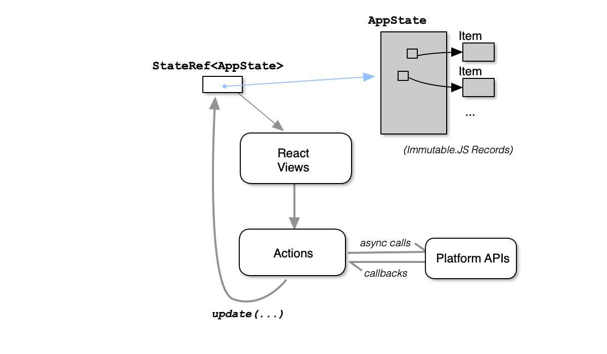
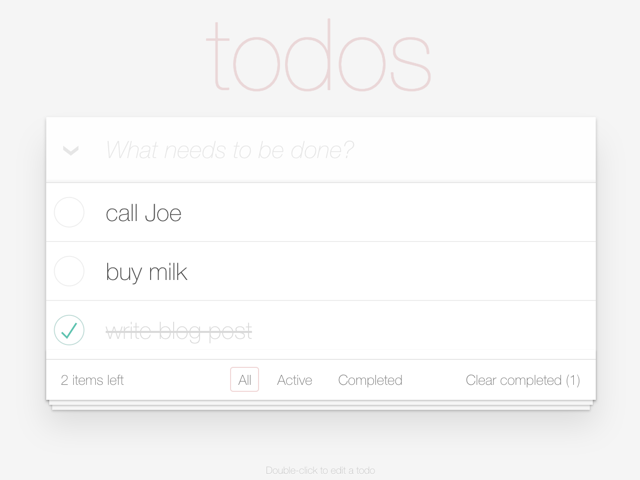
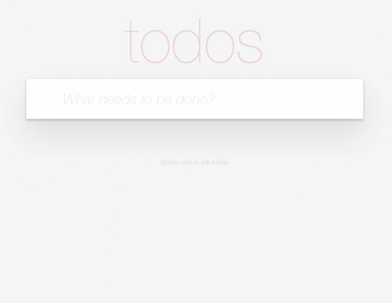
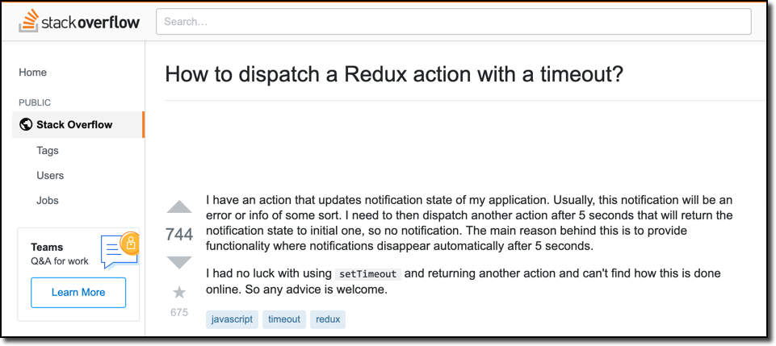
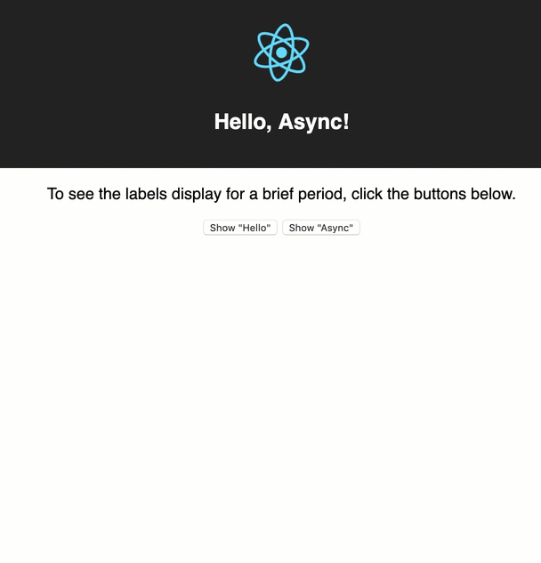
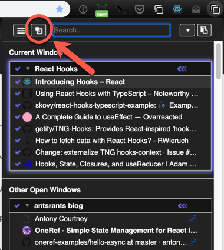
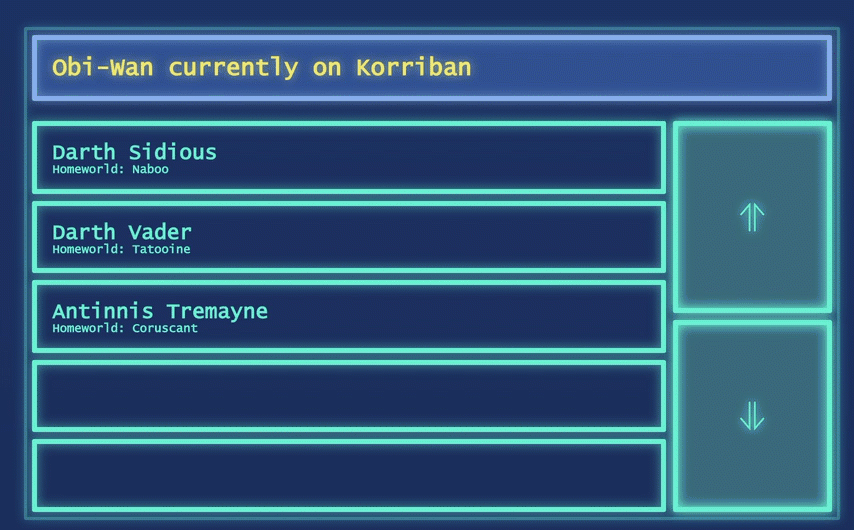

<strong>UNPUBLISHED DRAFT</strong>: This is an unpublished draft. If you are reading this, it is hopefully because I invited you to review this. <strong>Please do not share the link to
this post with others or on social media yet.</strong> Thank You!

---

> Everything should be made as simple as possible, but not simpler.
> --Albert Einstein

<strong>OneRef</strong> is a tiny (around 150 lines of code) state management library
written in TypeScript for use with React.
The goal of OneRef is to present a programming interface for state management that is as
simple as possible while still providing enough features and
expressive power to support real-world use cases such as interaction of application state with asynchronous platform APIs.

I originally developed OneRef in 2015 as a simpler alternative to the [Flux architecture](https://facebook.github.io/flux/docs/overview.html). I used it in my first production React application
([Tabli](https://chrome.google.com/webstore/detail/tabli/igeehkedfibbnhbfponhjjplpkeomghi), a tab manager extension for Google Chrome), and later in [Tad](https://www.tadviewer.com), a desktop application for viewing and analyzing CSV files.
By the time I completed the initial version of OneRef in 2015,
[Redux](https://redux.js.org/) had gained considerable traction and established itself as the de facto
standard for React state management. At the time I decided that Redux was sufficiently similar to OneRef that OneRef wasn't worth publicizing widely.

I recently rewrote OneRef in TypeScript for use with TypeScript and React Hooks. As part of this process, I struggled with a problem that still seems to present a significant challenge when using state management libraries: How to cleanly support interleaving asynchronous platform operations with reading and writing application state. In the Redux ecosystem this problem is
addressed by middleware libraries such as [redux-thunk](https://github.com/reduxjs/redux-thunk) and [redux-saga](https://redux-saga.js.org/). For this latest iteration of
OneRef, I added a couple of additional primitive operations (**mutableGet** and **awaitableUpdate**) to the OneRef API.
These additions seem to cleanly address the challenge of integrating application state with
asynchronous actions, but the interface and implementation could be controversial.
I'm writing this blog post mainly to present this part of the OneRef design and solicit feedback
from the React community.

---

<strong>A Quick Caveat:</strong> I happen to work at Facebook, home of the
React team.
While I have immense admiration for the work of the React team,
I do not work with them directly. In fact, I don't even do React
development as part of my job.
The work reported here
was done entirely on my own time as part of
maintaining [Tabli](https://chrome.google.com/webstore/detail/tabli/igeehkedfibbnhbfponhjjplpkeomghi) and [Tad](https://www.tadviewer.com), my hobby open source side projects.
Any and all mistakes, terrible ideas, conclusions, opinions or recommendations included here are entirely my own, not those of Facebook or any Facebook team.

---

## OneRef Overview

This section presents an overview of OneRef. Readers already familiar with Redux can lightly skim this section and the next one, and resume reading at [Comparison with Redux](#comparison-with-redux).

The OneRef architecture looks roughly like this:



The application state (AppState) is represented as a purely functional (immutable) data structure.
I use [Immutable.JS](https://immutable-js.github.io/immutable-js/) for this purpose, but this is not a strict requirement;any immutable data structure representation should do, and oneref does not depend on ImmutableJS.

At the top level of a OneRef application, there is a single mutable ref cell
(**StateRef**) that holds the current application state.

Application state is updated in OneRef by calculating a new AppState from the existing AppState and setting the top level StateRef to this new AppState. OneRef provides a single entry point, **update**, for this purpose:

```typescript
type StateTransformer<T> = (s: T) => T;
type StateRef<T> = ...; // opaque
function update<T>(ref: StateRef<T>, tf: StateTransformer<T>) { ... }
```

The update function in OneRef is similar to the [functional update](https://reactjs.org/docs/hooks-reference.html#functional-updates) variant of [useState](https://reactjs.org/docs/hooks-reference.html#usestate) in React Hooks. The only slight difference is the additional ref parameter
that is passed down through React views and into event handler callbacks.

**Actions** in OneRef are ordinary JavaScript functions called by event handlers in view components. They typically live in a source file outside of the React views, take whatever parameters are needed to perform the action, and calculate a **StateTransformer** function (a pure State => State function) passed to **update** to update the
application state.

## TodoMVC in OneRef

To make the previous discussion a bit more concrete, let's walk through the implementation of a complete example -- the classic Todo list application of [TodoMVC](http://todomvc.com/). The complete working
example is available [on CodeSandbox](https://codesandbox.io/s/github/antonycourtney/oneref-examples/tree/master/todomvc)
and in the [OneRef examples repository](https://github.com/antonycourtney/oneref-examples/tree/master/todomvc).



To begin with, let's define an immutable representation of application state using [Immutable.JS Records](https://immutable-js.github.io/immutable-js/):

First we have the representation of individual items in the Todo list:

```typescript
import { Record } from 'immutable';

interface ItemProps {
  id: string;
  complete: boolean;
  text: string;
}

const defaultItemProps: ItemProps = {
  id: '',
  complete: false,
  text: '',
};

/* auxiliary function to generate a fresh id */
function genID() {
  return (+new Date() + Math.floor(Math.random() * 999999)).toString(36);
}

export default class TodoItem extends Record(defaultItemProps) {
  constructor(text: string, complete = false) {
    super({ id: genID(), text, complete });
  }
}
```

The Application State (AppState) is an immutable record, with a single field, **todoItems**, an (immutable) Map from item id to items:

```typescript
import { Map, Record, Seq } from 'immutable';
import TodoItem from './todoItem';

interface AppStateProps {
  todoItems: Map<string, TodoItem>;
}

const defaultStateProps: AppStateProps = {
  todoItems: Map(),
};

export default class TodoAppState extends Record(defaultStateProps) {
  /**
   * Add / update a TODO item
   *
   * functional item update -- returns a new state with the given item included in the
   * set of todo items.  If there is an existing entry for item.id, the result state
   * will map id to item (functional update).
   */
  addItem(item: TodoItem): TodoAppState {
    const nextTodoItems = this.todoItems.set(item.id, item);
    return this.set('todoItems', nextTodoItems);
  }

  /**
   * functional delete -- returns a new state with the item for the given id removed
   */
  removeItem(id: string): TodoAppState {
    const nextTodoItems = this.todoItems.delete(id);
    return this.set('todoItems', nextTodoItems);
  }

  /** An Immutable.Seq of all todo items */
  getAll(): Seq.Set<TodoItem> {
    return this.todoItems.toSetSeq();
  }

  /* returns true iff all items are complete */
  areAllComplete(): boolean {
    return this.todoItems.every(item => item.complete);
  }
}
```

**TodoAppState** includes a few convenience methods, such as **addItem**. These methods
are all functional in the sense that they do not perform in-place updates; instead they return a
new **TodoAppState** object. Immutable.JS uses structural sharing to ensure that this is relatively efficient. Thus far, all of this is independent of OneRef.

The UI is implemented as a set of functional React components. A representative example is **Header**, which contains the text entry component used to add an item to the todo list:

```typescript
import React from 'react';
import TodoAppState from '../todoAppState';
import TodoTextInput from './TodoTextInput';
import * as actions from '../actions';
import { StateRef, update } from 'oneref';

interface HeaderProps {
  stateRef: StateRef<TodoAppState>;
}

const Header = ({ stateRef }: HeaderProps) => {
  const onSave = (text: string) => {
    if (text.trim()) {
      update(stateRef, actions.createTodo(text));
    }
  };

  return (
    <header className="header">
      <h1>todos</h1>
      <TodoTextInput
        className="new-todo"
        placeholder="What needs to be done?"
        onSave={onSave}
      />
    </header>
  );
};
export default Header;
```

The props for this component includes **stateRef**, which is passed down the component hierarchy. The **onSave** callback for the text entry component calls **update** to update the
application state, passing in **stateRef** and the result of **actions.createTodo(...)**.

The **actions** module contains the actions such as **createTodo** that return **StateTransformer**
functions (pure functions from AppState to AppState) that can be passed to **update**:

```typescript
import TodoItem from './todoItem';
import TodoAppState from './todoAppState';
import { StateTransformer } from 'oneref';

export const createTodo = (text: string): StateTransformer<TodoAppState> => {
  const item = new TodoItem(text);
  return state => state.addItem(item);
};

export const clearCompleted: StateTransformer<TodoAppState> = state => {
  const completedIds = state
    .getAll()
    .filter(item => item.complete)
    .map(item => item.id);
  return completedIds.reduce((s, id) => s.removeItem(id), state);
};

export const updateText = (
  item: TodoItem,
  text: string
): StateTransformer<TodoAppState> => state =>
  state.addItem(item.set('text', text));

export const toggleComplete = (
  item: TodoItem
): StateTransformer<TodoAppState> => state =>
  state.addItem(item.set('complete', !item.complete));

export const toggleCompleteAll: StateTransformer<TodoAppState> = state => {
  const targetVal = !state.areAllComplete();
  // We'll set completed state of all items to targetVal:
  const updItems = state.getAll().map(item => item.set('complete', targetVal));
  const nextState = updItems.reduce((st, item) => st.addItem(item), state);
  return nextState;
};

export const destroy = (id: string): StateTransformer<TodoAppState> => state =>
  state.removeItem(id);
```

To tie everything together, at the top level the application creates an initial
**TodoAppState** instance, and calls **oneref.appContainer** to construct a top-level
React component. The argument to **appContainer** is a functional React
component that will receive the initial application state and **stateRef** as props, injected
by **appContainer**:

```typescript
import React from 'react';
import ReactDOM from 'react-dom';
import * as oneref from 'oneref';
import TodoListEditor from './components/TodoListEditor';
import TodoAppState from './todoAppState';

import 'todomvc-common/base.css';
import 'todomvc-app-css/index.css';

const initialAppState = new TodoAppState();

const TodoApp = oneref.appContainer<TodoAppState>(
  initialAppState,
  TodoListEditor
);

ReactDOM.render(<TodoApp />, document.getElementsByClassName('todoapp')[0]);
```

### Comparison with Redux

For those familiar with Redux, the similarities and differences from Redux should be apparent from
the previous example. Redux and OneRef are both based on immutable application state that remains
frozen throghout each render cycle. Both Redux and OneRef update the application state centrally by
evaluating an application-supplied function that calculates a new state from an old state (a **reducer** in
Redux, a **StateTransformer** in OneRef). Both Redux and OneRef inject a capability into the top-level component
that is passed down the component hierarchy and enables
event handlers to schedule asynchronous functional updates to the application state in response to external events,
whether from the DOM or other sources.

The main difference between OneRef and Redux is that in Redux, the application developer creates explicit action objects
that are then examined and de-constructed in the reducer to determine the functional update to apply to the application
state. In OneRef, in contrast, there are no explicit action objects. Instead, OneRef actions return **StateTransformers** (pure State to State functions) that determine the next application state from the current
state. These state transformers are passed to OneRef's **update** operation to actually schedule applying the
update to the application state; OneRef's **update** thus serves a similar role to **dispatch** in Redux.

I believe that OneRef and Redux (at least in its classic form, not counting middleware) are roughly equivalent in expressive power. To show this, there is a straightforward mechanical transformation to port a OneRef application to Redux:

- Define a constant value for each of the OneRef application's action functions ( in this example: `'CREATE_TODO'`, `'CLEAR_COMPLETED'`, `'UPDATE_TEXT'`, etc.)
- Modify each action function to create and return an action object of the appropriate type, with extra fields for any free variables appearing in the `state => state` function returned by the OneRef action implementation.
- Write a single _reducer_ function for the application that accepts an action object, switches on the action type, and has a `case` clause for of each of the `state => state` functions returned by the actions in the OneRef version.

For the TodoMVC example, this action from the OneRef implementation:

```typescript
export const createTodo = (text: string): StateTransformer<TodoAppState> => {
  const item = new TodoItem(text);
  return state => state.addItem(item);
};
```

in a Redux implementation would become:

```typescript
export const createTodo = (text: string): TodoAction => {
  const item = new TodoItem(text);
  return {
    type: 'CREATE_TODO',
    item,
  };
};
```

with an application-wide reducer function:

```typescript
export const todoReducer = (state: TodoAppState, action: TodoAction): TodoAppState => {
    switch (action.type) {
        case 'CREATE_TODO':
            return state.addItem(action.item);
        ... // cases for all other message types here
    }
}
```

(Details of type definitions for `TodoAction` omitted)

In the absence of middleware, it is similarly straightforward to go the other direction, and mechanically
translate a Redux application to OneRef. So, OneRef and Redux seem roughly equivalent in expressive power.

The difference between OneRef and Redux, then, comes down to this: OneRef eliminates the
need to define, name, create and switch on explicit action objects. Instead, in OneRef, action functions
define anonymous state transformer functions that specify how to calculate the new state from
the current state. This is arguably a simpler, more direct programming model.

However, the extra indirection of Redux's explicit action objects do provide
significant benefits: They enable clear and useful logging, they naturally support record and replay
style testing without elaborate mocks, they can potentially be sent across thread or process boundaries,
and they enable an ecosystem of powerful middleware extensions that can be interposed between construction
of an action message and applying this to the store to provide additional services.

The choice between OneRef and Redux for a given application, then, comes down to a combination of

- Subjective aesthetics: I happen to like the style of writing all code related to an action, including state
  transformers, in one place (the action function), with no additional overhead.
  However, reasonable people can disagree: In Redux, all state transformation
  is concentrated in a single reducer function, which provides a useful central point to watch when debugging.
- Whether the application needs the additional functionality enabled by Redux's explicit action objects.

Aside from these technical considerations, practical social considerations weigh heavily in favor
of Redux: Redux is mature, well maintained, well tested, well documented, and has a thriving developer community. I'm writing this
post to describe the underlying ideas in a technical setup that has worked well for my own applications.
While you are welcome to try OneRef, it is currently just an experimental library I have used in minor side projects.

## Asynchronous Operations

One of the most challenging aspects of developing React applications is managing the interaction of application state with asynchronous operations. In this section I present a couple of examples that demonstrate how this works in
OneRef.

### Basic Asynchronous Subscriptions

To begin with, let's consider a simple extension of the TodoMVC Example to support sharing a Todo list with
several users. As before, the complete working
example is available [on CodeSandbox](https://codesandbox.io/s/github/antonycourtney/oneref-examples/tree/master/todo-async-basic)
and in the [OneRef examples repository](https://github.com/antonycourtney/oneref-examples/tree/master/todo-async-basic).

A real shared, multi-user Todo list would involve a fairly sophisticated synchronization protocol. For exposition, we'll focus only on creation of new Todo list items by other users. The working
Todo list app might look like this as new items are added by other users:



Let's assume our Todo list server provides a very simple subscription API via a **subscribe** function that
invokes a callback whenever an entry is added to the Todo list:

```typescript
type TodoListener = (entry: string) => void;
export const subscribe = (listener: TodoListener);
```

The relevant changes to `index.tsx` to implement this example are:

```typescript
...
import {
    appContainer,
    StateRef,
    AppStateEffect,
    utils as onerefUtils
} from 'oneref';
...
const init: AppStateEffect<TodoAppState> = (
    appState: TodoAppState,
    stateRef: StateRef<TodoAppState>
) => {
    const serviceIter = onerefUtils.publisherAsyncIterable(
        todoServer.subscribe
    );
    const stIter = onerefUtils.aiMap(serviceIter, actions.createTodo);
    onerefUtils.updateFromIterable(stateRef, stIter);
};

const initialAppState = new TodoAppState();

const TodoApp = appContainer<TodoAppState, {}>(
    initialAppState,
    TodoListEditor,
    init
);

ReactDOM.render(<TodoApp />, document.getElementsByClassName('todoapp')[0]);
```

As before, we are calling **appContainer** to create the top-level React application component. This time, however, we are passing an extra **init** argument, of type **AppStateEffect&lt;TodoAppState&gt;**. This is a function that will be
called to perform any initialization side effects, in this case setting up the subscription handling.

The body of **init** is a sequence of three calls to utility routines in **onerefUtils**. The first two calls (to **publisherAsyncIterable** and **aiMap**) are generic utilities that are useful but not specifically related to
oneref. The call to **publisherAsyncIterable** converts a callback based subscription API into an [AsyncIterable](https://www.typescriptlang.org/docs/handbook/release-notes/typescript-2-3.html). The result, bound to **serviceIter**, is of type **AsyncIterable&lt;string&gt;**. The call to **aiMap** is a simple **map** operation over AsyncIterables, applying a function to every element of an async iterable. In this case, we pass **actions.createTodo**, mapping every string from the iterable
to a **StateTransformer&lt;TodoAppState&gt;**; hence **stIter** has type **AsyncIterable&lt;StateTransformer&lt;TodoAppState&gt;&gt;**.

Finally, **stIter** is passed to **updateFromIterable**. The implementation of **updateFromIterable** is an async
function that invokes the primitive oneref **update** operation on every state transformer function delivered by
the async iterable:

```typescript
export async function updateFromIterable<AS>(
  ref: StateRef<AS>,
  stream: AsyncIterable<StateTransformer<AS>>
): Promise<void> {
  for await (const st of stream) {
    update(ref, st);
  }
}
```

All of these functions live in **oneref.utils** because they are not really primitive functionality; all that's really
happening here is that the oneref **update** primitive is called from an asynchronous context after the **init** function has completed. While I find this use of **AsyncIterable** a natural and concise way to think about subscriptions, the
**init** function could also be implemented simply and directly with a subscription callback that calls **update** directly:

```typescript
const init: AppStateEffect<TodoAppState> = (
  appState: TodoAppState,
  stateRef: StateRef<TodoAppState>
) => {
  todoServer.subscribe((entry: string) => {
    update(stateRef, actions.createTodo(entry));
  });
};
```

In order to ensure this works correctly, OneRef guarantees that the **StateRef** value is stable across state updates
over the entire lifetime of the top level application component instance.

### Hello, Async!

The previous subscription example demonstrates one simple but common use case: an asynchronous operation or event callback that updates application state asynchronously. That use case didn't require any new primitives; the application
just calls **update** from the callback.

A challenge with micro-examples is that they sometimes don't capture all the nuances or use cases that crop up in
real application development. In real applications, it's common for actions to need to perform sequences of asynchronous operations, where operations later in the sequence are invoked only after earlier operations complete. The syntax
for **async** blocks in ES6 support exactly such sequencing. And, as we have seen, there's no problem
with interleaving calls to **update** in a sequence of async operations.

The challenge, though, is that **update** is a _write-only_ operation. It allows the application to arrange for an
update to application state, but provides no mechanism for invoking asynchronous operations based on the current
application state in the middle of an asynchronous block. This presents a significant challenge for classic
Redux or OneRef as described thus far.

The extent to which this is a challenging problem is reflected in the length and breadth of answers to [this
StackOverflow question](https://stackoverflow.com/questions/35411423/how-to-dispatch-a-redux-action-with-a-timeout/38574266):



[Tyler Long](https://stackoverflow.com/users/862862/tyler-long) was kind enough to distill this question down to
a concise runnable example made with create-react-app and create a [Github repository](https://github.com/tylerlong/hello-async) with runnable versions of the various Redux solutions.

The hello-async example, when running, looks like this:



Each of the buttons adds a label to the UI that is displayed for a fixed timeout period. After the timeout period, the label is hidden. A runnable version of the OneRef implementation of this example is available [on Codesandbox](https://codesandbox.io/s/github/antonycourtney/oneref-examples/tree/master/hello-async) and in [the oneref-examples repository](https://github.com/antonycourtney/oneref-examples/tree/master/hello-async).

As before, the application state is represented with an Immutable.JS Record:

```typescript
import * as Immutable from 'immutable';
import Notification from './notification';

interface AppStateProps {
  nextId: number;
  notifications: Immutable.List<Notification>;
}

const defaultAppStateProps: AppStateProps = {
  nextId: 0,
  notifications: Immutable.List(),
};

export default class helloAppState extends Immutable.Record(
  defaultAppStateProps
) {
  show(text: string): [this, number] {
    const n = new Notification(this.nextId, text);

    const nextSt = this.set('notifications', this.notifications.push(n)).set(
      'nextId',
      this.nextId + 1
    );
    return [nextSt, n.id];
  }

  hide(id: number): this {
    return this.set(
      'notifications',
      this.notifications.filter(n => n.id !== id)
    );
  }
}
```

Here we maintain `nextId` as part of the main application
state, so the specific `id` value for a notification is only available after calling **show**, which returns
a pair of a next application state and the id for the notification that will be displayed.

The React UI is straightforward; the essential part is this:

```typescript
<div>
  <button
    onClick={() => actions.showNotificationWithTimeout(stateRef, 'Hello')}
  >
    Show "Hello"
  </button>
  &nbsp;
  <button
    onClick={() => actions.showNotificationWithTimeout(stateRef, 'Async')}
  >
    Show "Async"
  </button>
  {appState.notifications.map(notification => (
    <h1 key={notification.id}>{notification.text}</h1>
  ))}
</div>
```

The most interesting part of the implementation is the implementation of the single action in this application,
**showNotificationWithTimeout**:

```typescript
import {
  StateRef,
  update,
  awaitableUpdate,
  utils as oneRefUtils,
} from 'oneref';
import HelloAppState from './helloAppState';

const delay = oneRefUtils.delay;

export async function showNotificationWithTimeout(
  stateRef: StateRef<HelloAppState>,
  text: string
): Promise<void> {
  const [_, id] = await awaitableUpdate(stateRef, st => st.show(text));
  await delay(5000);
  update(stateRef, st => st.hide(id));
}
```

This differs from previous actions we've seen in two important ways: First, **stateRef** is passed in directly to the action, instead of the action returning a **StateTransformer** that the caller passes to **update**.
Second, this is an **async** function. Since it's called from a non-async function (the **onClick** callback),
**showNotificationWithTimout** is effectively a co-routine that executes independently alongside the rest of the
application.

The most interesting part of this action is the call to **awaitableUpdate**, a new primitive
added to OneRef that has the following signature:

```typescript
// A StateTransformer with an additional calculated value:
export type StateTransformerAux<T, A> = (s: T) => [T, A];
export async function awaitableUpdate<T, A>(
  ref: StateRef<T>,
  tf: StateTransformerAux<T, A>
): Promise<[T, A]>;
```

A **StateTransformerAux** is a similar to a **StateTransformer**, but also returns an extra auxiliary value along
with the next state. In **showNotificationWithTimeout**, the call to **HelloAppState.show** returns a pair of the next application state and the id
of the newly created notification added to the application state. **awaitableUpdate** is an async function that,
like **update** schedules an update of the application state referenced by **stateRef**. However, after updating
the application state (using the first component of the pair returned by **tf**), **awaitableUpdate** resolves
a promise, making the [State, Auxiliary Value] pair available to **awaitableUpdate**'s caller.

At first it seems a bit odd to provide an awaitable version of **update** -- why should the application await on its
own state updates? But the React programming model requires that **update** (and its React ancestor, **setState**) is an asynchronous operation -- the update can not be applied synchronously to the current state since state must remain
frozen until the current render cycle completes. The addition of **awaitableUpdate** solves an important practical problem: It enables an async block to resume _after_ an update has been applied, and see fresh data derived from the application state as of the time of the update.

This enables writing complex application action sequences with linear control flow in the style of redux-saga (a source of inspiration for this work), using async functions instead of generator functions.
Generator functions and redux-saga's generalized algebraic effects are extremely powerful, so I don't expect or claim that OneRef with awaitableUpdate subsumes everything that can be expressed with redux-saga. My hope (which will have to
wait until more experience accumulates) is that the addition of **awaitableUpdate** offers sufficient expressive
power to cover many essential use cases in real applications.

### mutableGet

In using this latest version of **OneRef** to port [Tabli](https://chrome.google.com/webstore/detail/tabli/igeehkedfibbnhbfponhjjplpkeomghi) (a Chrome extension for tab management) to TypeScript and Hooks, I observed
that, in many cases, action functions invoked as callbacks needed read access to the current application
state at the time the callback was invoked (as opposed to the time the callback was created),
without necessarilly needing to perform an update to the state.

A good example of this is the behavior of Tabli's popout button:



The intended behavior of the popout button is that it should open the Tabli popout window only if it is not currently open. If it is already open, the popout button should transfer focus to the (already open) popout window instead of opening a new one.

Tabli maintains a detailed snapshot of all open windows as part of its application state, including the current
popout window. The implementation of the **showPopout** action in Tabli is:

```typescript
export const showPopout = (stateRef: StateRef<TabManagerState>) => {
  const ptw = mutableGet(stateRef).getPopoutTabWindow();
  if (ptw) {
    tabliBrowser.setFocusedWindow(ptw.openWindowId);
  } else {
    chromep.windows.create({
      url: 'popout.html',
      type: 'popup',
      left: 0,
      top: 0,
      width: Constants.POPOUT_DEFAULT_WIDTH,
      height: Constants.POPOUT_DEFAULT_HEIGHT,
    });
  }
};
```

This action makes use of **mutableGet**, another OneRef primitive API function with the following signature:

```typescript
export function mutableGet<T>(ref: StateRef<T>): T;
```

The behavior of **mutableGet** is what one would intuitively expect: it (synchronously) returns the
current state value referenced by a **stateRef**. The verbose name of this function is intended as
something of a warning label to indicate that repeated calls to mutableGet on the same **stateRef**
at different points in the execution of the program may return different values. While it is
reasonable to call **mutableGet** within the (imperative) body of an action function in response to
an event, one should never call **mutableGet** directly in the body of a React functional component or **render()** method, since these should ideally be pure functions of their props that can be memoized with **React.memo**.

### Andre Staltz's Flux Challenge

A final example of the interaction of application state with asynchronous requests comes from the [Flux Challenge](https://github.com/staltz/flux-challenge) by Andre Staltz. The Flux Challenge is another example application for a
real-time dashboard user interface for monitoring the movement of Jedi and Sith in the Star Wars Universe:



The application involves both subscribing to a web socket and issuing http fetch requests in response to user
actions to populate the dashboard. The requirements for the challenge are quite intricate, but express the
sorts of messy, complex requirements of real applications and asynchronous platform APIs. For example,
the requirements stipulate:

> When either the current planet indicator changes OR loaded new rows: check if there is a displayed Dark
> Jedi whose home planet matches the current planet. If true, then display that Dark Jedi in red text,
> and cancel ALL ongoing HTTP requests for rows. Freeze the UI from scrolling until the current planet
> changes again and there is no red-highlighted Dark Jedi anymore.

The OneRef implementation of the Flux Challenge can also be found in the [OneRef examples respository](https://github.com/antonycourtney/oneref-examples/tree/master/flux-challenge). Unfortunately this example also requires running
a separate WebSocket server (provided in the [original flux challenge repository](<(https://github.com/staltz/flux-challenge)>)), so I can't provide a live version in
a CodeSandbox.

This post is far too long already, so I'll forego a complete walk-through of this example. But **awaitableUpdate**
enabled a fairly concise implementation of this example in OneRef.
For example, here is the implementation of
the async action invoked in response to updates to Obi-Wan's position from the WebSocket subscription, to implement
the behavior described in the above requirement:

```typescript
const updateObiWan = async (
  parsedLocation: any,
  stateRef: StateRef<DashboardAppState>
) => {
  const [nextSt, oldRequests] = await awaitableUpdate(stateRef, state => {
    const obiWanLocation = new DT.PlanetInfo(parsedLocation);
    const locState = state.set('obiWanLocation', obiWanLocation);
    return locState.checkMatchingSith();
  });
  cancelOldRequests(oldRequests);
  if (!nextSt.matchingSith()) {
    fillView(nextSt, stateRef);
  }
};
```

## Composition

Another concern with state management libraries is _composition_ or _modularity_. All of the examples thus far show a single top-level application state that runs through the entire application. What happens when we want to combine
multiple mega components developed with OneRef and compose them into a larger application?

As an example, consider building a "Multi-TodoList" application that provides distinct Todo lists for work and
personal entries, each composed of the fully functioning TodoMVC list editor from the beginning of this post.
A working version of this would look something like this:

## Other concerns

#### Testing

#### Performance

```

```
